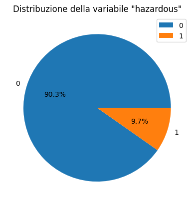

# ML-Laboratory
🚀 ML-Laboratory – Analisi e Predizione di Asteroidi Potenzialmente Pericolosi

📍 Un progetto di machine learning per analizzare e prevedere il rischio di oggetti vicini alla Terra (Near-Earth Objects) sulla base di dati reali forniti dalla NASA.

📓 [Source of the dataset](https://www.kaggle.com/datasets/shrutimehta/nasa-asteroids-classification)

## 👨‍🎓 Team Members:
Mattia Biancini – 865966
Lorenzo Monti – 869960
Marco Gherardi – 869138

## 🧪 Technologies Used
🐍 Python

📓 Google Colab

📊 Pandas, Matplotlib, Seaborn – EDA e visualizzazione

🤖 Scikit-learn – ML models e visualizzazione

🔗 GitHub – Version control e collaborazione

## Summary:
- [Descrizione del dominio di riferimento e obiettivi dell’elaborato](https://github.com/MattiaBiancini/ML-Laboratory?tab=readme-ov-file#descrizione-del-dominio-di-riferimento-e-obiettivi-dellelaborato)
- [Scelte di design per la creazione del data set, eventuali ipotesi o assunzioni](https://github.com/MattiaBiancini/ML-Laboratory?tab=readme-ov-file#scelte-di-design-per-la-creazione-del-data-set-eventuali-ipotesi-o-assunzioni)
- [Descrizione del dataset e relativa analisi esplorativa](https://github.com/MattiaBiancini/ML-Laboratory?tab=readme-ov-file#descrizione-del-dataset-e-relativa-analisi-esplorativa)
  - [Descrizione delle variabili](https://github.com/MattiaBiancini/ML-Laboratory?tab=readme-ov-file#descrizione-delle-variabili)
  - [Analisi esplorativa](https://github.com/MattiaBiancini/ML-Laboratory?tab=readme-ov-file#analisi-esplorativa)
    1) [Comprensione del quadro generale](https://github.com/MattiaBiancini/ML-Laboratory?tab=readme-ov-file#1-comprensione-del-quadro-generale)
    2) [Preparazione](https://github.com/MattiaBiancini/ML-Laboratory?tab=readme-ov-file#2-preparazione)
    3) [Comprensione delle variabili](https://github.com/MattiaBiancini/ML-Laboratory?tab=readme-ov-file#3-comprensione-delle-variabili-analisi-univariata)
    4) [Studio delle relazioni tra variabili](https://github.com/MattiaBiancini/ML-Laboratory?tab=readme-ov-file#4-studio-delle-relazioni-tra-variabili)
- [Descrizione e motivazione dei modelli di machine learning scelti](https://github.com/MattiaBiancini/ML-Laboratory?tab=readme-ov-file#descrizione-e-motivazione-dei-modelli-di-machine-learning-scelti-almeno-due-modelli)
- [Esperimenti: esecuzione di almeno una modalità di validazione e stima delle misure di performance](https://github.com/MattiaBiancini/ML-Laboratory?tab=readme-ov-file#esperimenti-esecuzione-di-almeno-una-modalit%C3%A0-di-validazione-e-stima-delle-misure-di-performance)
- [Analisi dei risultati ottenuti](https://github.com/MattiaBiancini/ML-Laboratory?tab=readme-ov-file#analisi-dei-risultati-ottenuti)
- [Conclusioni](https://github.com/MattiaBiancini/ML-Laboratory?tab=readme-ov-file#conclusioni)

### Descrizione del dominio di riferimento e obiettivi dell’elaborato 
Nello spazio esterno esiste un numero infinito di oggetti. Alcuni di essi sono più vicini di quanto si possa pensare. Sebbene possa sembrare che una distanza di 70.000 km non possa potenzialmente arrecare danno, a scala astronomica questa rappresenta una distanza molto limitata e può interferire con numerosi fenomeni naturali. Tali oggetti/asteroidi possono dimostrarsi dannosi. Pertanto, è prudente conoscere ciò che ci circonda e identificare eventuali minacce tra di essi. Questo insieme di dati raccoglie l'elenco degli asteroidi certificati dalla NASA classificati come oggetti più vicini alla Terra.

Obiettivo dell'elaborato sara' addestrare un modello di ML il quale riuscira' a predirre quando un oggetto e' pericoloso o meno.

### Descrizione del dataset e relativa analisi esplorativa

#### Descrizione delle variabili

| Variabile | Tipo | Contesto | Aspettativa | commenti |
|-----------|------|----------|-------------|----------|
| **id** | int | Valore di identificazione del singolo oggetto | Bassa | |
| **name** | Object | Valore di identificazione del singolo oggetto | Bassa | |
| **est_diameter_min** | Float | Misura minore "possibile" estimata del diametro | Media | |
| **est_diameter_max** | Float|Misura più alta "possibile" estimata del diametro | Media | |
| **relative_velocity** | Float | Misura della velocità dell'oggetto | Alta| |
| **miss_distance** | Float | Distanza tra la terra e l'oggetto | Media | |
| **orbiting_body** | Object |il corpo attorno cui orbita l'oggetto | Bassa | Il corpo è sempre la terra |
| **sentry_object** | Bool | ncluso in sentry - un sistema automatizzato di monitoraggio delle collisioni | Bassa | Sono tutti false |
| **absolute_magnitude** | Float | Misura della luminosità intrinseca | Media |  |
| **hazardous** | Bool | True se l'oggetto è considerato pericoloso, false altrimenti | Alta ||

#### Analisi esplorativa

L’analisi esplorativa del dato (exploratory data analysis, EDA) è di fondamentale importanza perché permette all’analista di conoscere a fondo il dataset sul quale lavora, stipulare o scartare ipotesi e creare dei modelli predittivi su basi solide.
Si è deciso di suddividere questa fase nei seguenti punti: Comprensione del quadro generale, Preparazione, Comprensione delle variabili e Studio delle relazioni tra variabili

#### ✅ 1. Comprensione del quadro generale

Il dataset ha dimensione di 90836 righe e 10 colonne, di seguito viene riportata una tabella descrittiva di alcuni tra i valori statistici fondamentali:

</style>
<table border="1" class="dataframe">
  <thead>
    <tr style="text-align: right;">
      <th></th>
      <th>id</th>
      <th>est_diameter_min</th>
      <th>est_diameter_max</th>
      <th>relative_velocity</th>
      <th>miss_distance</th>
      <th>absolute_magnitude</th>
    </tr>
  </thead>
  <tbody>
    <tr>
      <th>count</th>
      <td>9.083600e+04</td>
      <td>90836.000000</td>
      <td>90836.000000</td>
      <td>90836.000000</td>
      <td>9.083600e+04</td>
      <td>90836.000000</td>
    </tr>
    <tr>
      <th>mean</th>
      <td>1.438288e+07</td>
      <td>0.127432</td>
      <td>0.284947</td>
      <td>48066.918918</td>
      <td>3.706655e+07</td>
      <td>23.527103</td>
    </tr>
    <tr>
      <th>std</th>
      <td>2.087202e+07</td>
      <td>0.298511</td>
      <td>0.667491</td>
      <td>25293.296961</td>
      <td>2.235204e+07</td>
      <td>2.894086</td>
    </tr>
    <tr>
      <th>min</th>
      <td>2.000433e+06</td>
      <td>0.000609</td>
      <td>0.001362</td>
      <td>203.346433</td>
      <td>6.745533e+03</td>
      <td>9.230000</td>
    </tr>
    <tr>
      <th>25%</th>
      <td>3.448110e+06</td>
      <td>0.019256</td>
      <td>0.043057</td>
      <td>28619.020645</td>
      <td>1.721082e+07</td>
      <td>21.340000</td>
    </tr>
    <tr>
      <th>50%</th>
      <td>3.748362e+06</td>
      <td>0.048368</td>
      <td>0.108153</td>
      <td>44190.117890</td>
      <td>3.784658e+07</td>
      <td>23.700000</td>
    </tr>
    <tr>
      <th>75%</th>
      <td>3.884023e+06</td>
      <td>0.143402</td>
      <td>0.320656</td>
      <td>62923.604633</td>
      <td>5.654900e+07</td>
      <td>25.700000</td>
    </tr>
    <tr>
      <th>max</th>
      <td>5.427591e+07</td>
      <td>37.892650</td>
      <td>84.730541</td>
      <td>236990.128088</td>
      <td>7.479865e+07</td>
      <td>33.200000</td>
    </tr>
  </tbody>
</table>

**Alucne osservazioni dei dati nella precedente tabella:**

##### Dimensioni stimate
- La dimensione stimata degli oggetti celesti nel dataset varia notevolmente, con un diametro minimo che va da 0.000609 a 37.892650 e un diametro massimo che va da 0.001362 a 84.730541.

##### Velocità relativa
- La velocità relativa degli oggetti celesti è abbastanza varia, con una media di circa 48,066 unità di misura e una deviazione standard di circa 25,293. La velocità minima registrata è di circa 203.35, mentre la massima è di circa 236,990.13.

##### Distanza ravvicinata
- La distanza più vicina alla quale gli oggetti celesti si avvicinano è compresa tra circa 6,745.53 e 74,798,650 unità di misura, con una media di circa 37,066,550. Questo indica una vasta gamma di distanze ravvicinate.

##### Magnitudine assoluta
- La magnitudine assoluta degli oggetti celesti varia da 9.23 a 33.2, con una media di circa 23.53. Questo fornisce informazioni sulla luminosità intrinseca degli oggetti celesti nel dataset.

##### Variazione nei dati
- Le deviazioni standard relativamente alte in alcune colonne indicano una significativa variazione nei dati. Ad esempio, la deviazione standard elevata nella colonna "relative_velocity" suggerisce una grande variabilità nelle velocità relative degli oggetti celesti.

#### 🔧 2. Preparazione
   
In questa fase si vuole iniziare a pulire il dataset in modo da continuare l’analisi. Alcune delle domande che aiuteranno a comprendere se il dataset contiene elementi da modificare sono:

1. **esistono variabili inutili o ridondanti?** 

    Si, ad esempio è evidente che le variabili centry_object e orbiting_body hanno lo stesso valore per ogni dato nel dataset, inoltre le variabili id e name servono entrmabe ad identificare un oggetto specifico. Per avere un dataset maggiormente ordinato e privi di variabili che non saranno oggetto di analisi, procederemo rimuovendo dal dataset òe varibili sentry_object, orbiting_body e name.

2. **Ci sono delle colonne duplicate?**
   
   No, non vi è presenza di colonne duplicate.
   
3. La nomenclatura ha senso?

    Si, il modo in cui le variabili sono nominate rappresentano in modo sintetico il loro significato intrinseco.
   
4. Ci sono delle nuove variabili che vogliamo creare?
   Si, potrebbe essere utile studiare la media tra est_diameter_min e est_diameter_max, quindi procederemo aggiungendo questa variabile nel dataset.
   

#### 🔍 3. Comprensione delle variabili (Analisi univariata)

Questa fase è fondamentale per comprendere e descrivere nel dettaglio le variabili di interesse all’interno del dataset. L’obiettivo principale è quello di analizzare la distribuzione delle singole feature, inclusa la variabile target (label), al fine di ottenere una visione più chiara della natura del problema che stiamo affrontando.

Attraverso l’esame della distribuzione delle variabili, possiamo:

- Individuare eventuali anomalie o valori atipici (outlier);

- Comprendere se i dati sono bilanciati o sbilanciati (nel caso di classificazione);

- Valutare la necessità di trasformazioni o normalizzazioni;

- Porre le basi per osservazioni più approfondite e per scelte modellistiche più consapevoli.

- Distribuzioni fortemente asimmetriche possono suggerire la presenza di outlier o di variabili non normalizzate.

- Classi sbilanciate e quindi servira' l'utilizzo di uno studio piu' approfondito su come andare a utilizzare le istanze al meglio

🔍 E quindi guidare scelte appropriate di preprocessing:

Se la variabile è fortemente asimmetrica, può essere utile applicare una trasformazione (es. logaritmica o Box-Cox) per renderla più vicina a una distribuzione normale.

Alcuni algoritmi di machine learning (come la regressione lineare o la SVM) assumono distribuzioni gaussiane, e quindi beneficiano di dati normalizzati.

#### 🔗 4. Studio delle relazioni tra variabili

Per quanto riguarda lo studio delle relazioni tra le variabili, abbiamo condotto diverse analisi esplorative con l’obiettivo di individuare eventuali pattern significativi e dipendenze statistiche tra le feature e la variabile target hazardous.

In particolare, ci siamo concentrati su:

L’analisi di correlazione, per osservare le relazioni lineari tra le variabili numeriche e identificare quelle potenzialmente più informative;

La distribuzione dei valori di hazardous, per comprendere in quali intervalli delle feature si concentra la presenza di oggetti potenzialmente pericolosi;

Box plot tra hazardous e le variabili numeriche, utili per visualizzare eventuali differenze di distribuzione tra i due gruppi (True e False) e rilevare la presenza di schemi ripetuti o valori anomali.

Attraverso queste analisi, abbiamo cercato di individuare segnali che potessero suggerire la presenza di relazioni utili da sfruttare in fase di modellazione predittiva.

### 🤖 Descrizione e Motivazione dei Modelli di Machine Learning Scelti
In questa sezione si presentano i modelli di machine learning utilizzati per affrontare il problema di classificazione degli oggetti celesti potenzialmente pericolosi (hazardous). L’obiettivo è valutare le performance predittive su una variabile binaria (hazardous = True/False), ottimizzando la capacità del modello di distinguere correttamente tra le due classi.

Sono stati selezionati e confrontati due modelli principali:

🌳 1. Albero di Decisione (Decision Tree Classifier)
L’albero di decisione è stato scelto per la sua semplicità interpretativa e per la capacità di modellare decisioni non lineari. Abbiamo agito sulla profondità massima e sul numero minimo di campioni per nodo al fine di regolare la complessità del modello e prevenire fenomeni di overfitting.

✅ Motivazioni:

Facilità di interpretazione visiva del processo decisionale;

Buone prestazioni su dataset con feature eterogenee;

🧠 2. Rete Neurale Multistrato (MLP – Multi-layer Perceptron)
Il secondo modello adottato è una rete neurale di tipo MLPClassifier. Questo modello, grazie alla sua struttura a più layer, è in grado di apprendere rappresentazioni complesse e non lineari dei dati. È stato configurato variando il numero di neuroni nei layer nascosti e la funzione di attivazione, nonché il numero di iterazioni massime.

✅ Motivazioni:

Capacità di catturare relazioni complesse;

Flessibilità e adattabilità a diverse distribuzioni;

Possibilità di migliorare le prestazioni tramite tuning accurato.

🔁 Validazione e Confronto dei Modelli
Per garantire una valutazione robusta e imparziale, è stata applicata la validazione incrociata (cross-validation) su entrambi i modelli, permettendo una stima più accurata delle loro prestazioni medie.

Abbiamo analizzato le metriche di classificazione principali:

Precisione

Recall

F1-score

Accuratezza

Media macro e ponderata

### 📊 Conclusioni dal Confronto

Il secondo modello (MLP) mostra una precisione elevata per la Classe 0 (oggetti non pericolosi), ma una recall più bassa rispetto al primo modello.

Per la Classe 1 (oggetti pericolosi), la rete neurale evidenzia una recall molto alta, ma una precisione significativamente bassa: ciò significa che tende a classificare molte istanze come pericolose, includendo anche falsi positivi.

L’albero decisionale, invece, mostra prestazioni più bilanciate tra precisione e recall per entrambe le classi.

La media macro ponderata conferma che, complessivamente, le performance del primo modello sono leggermente superiori in termini di equilibrio generale.
